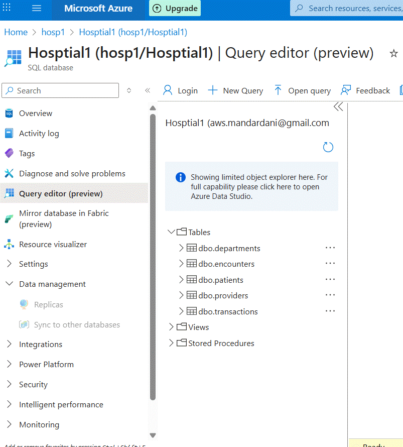
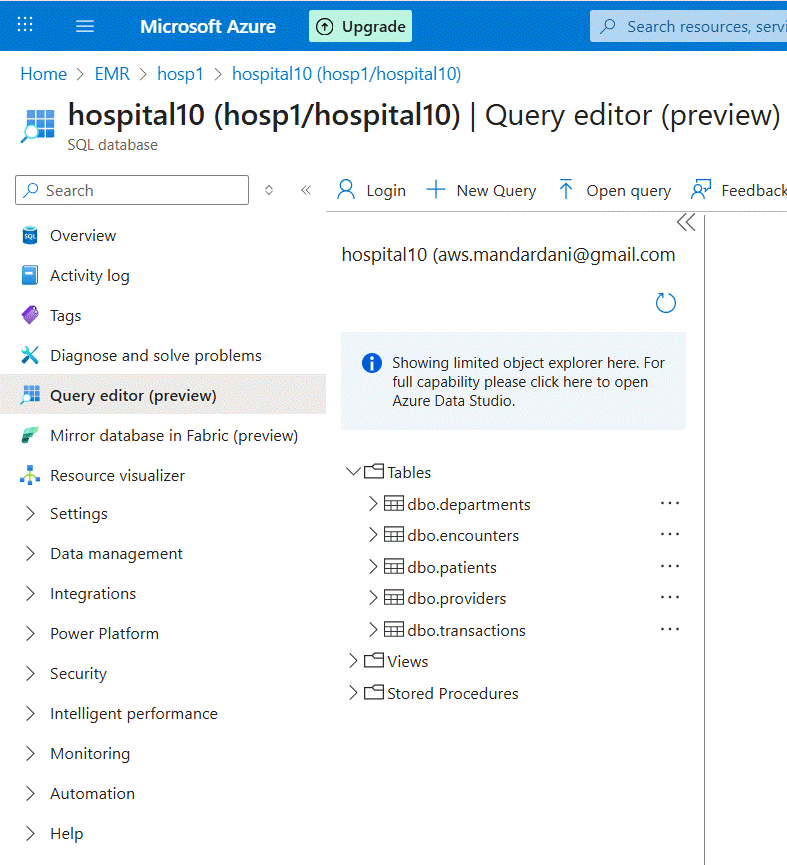

# 🏥 Metadata-Driven Data Ingestion Pipeline for Hospital Data

This repository contains a scalable, secure, and modular data ingestion framework built on Azure services. It ingests data from multiple SQL databases into Azure Data Lake Storage Gen2 using Azure Data Factory, and processes it using Azure Databricks following the Medallion Architecture.

---

## 📦 Architecture Overview

- **Source Systems**:  
  - Two Azure SQL Databases: `Hospital1` and `Hospital10`  
  - Each contains 5 tables: `Providers`, `Department`, `Patients`, `Encounters`, `Transactions`

- **connect both tables using vscode **
  - use bcp command to import csv files into both database tables.
  - command used example:
	cmd /c 'bcp [dbo].[transactions] in "C:\<local-path>\transactions.csv" -S <server> -d <database> -U h <user> -P <password> -c -t,'

- **Ingestion Layer**:  
  - Azure Data Factory (ADF) with metadata-driven pipeline  
  - Uses `load_config.csv` to control ingestion logic

- **Storage Layer**:  
  - Azure Data Lake Storage Gen2 with Hierarchical Namespace enabled  
  - Containers:
    - `config`: stores configuration files and job logs
    - `bronze`: stores raw ingested data as Parquet files

- **Processing Layer**:  
  - Azure Databricks (Runtime 14.3 LTS)  
  - Unity Catalog for governance  
  - External location linked to `config` container  
  - Table: `pipelines.jobrun.load_logs`

##Define table to record ADF jobrun log (load_logs):

- **Go to Catalog: create catalog name: pipelines (External Location: config folder)
	schema: jobrun, table name: load_logs

- **Go to azure home => 
	Create: Azure Databrics access connector, keep Resource ID copied
- **Go to Storage =>
	Iam - Assign role - Azure Blob data contributor - select Azure Databricks access connector created above and assign
- **Go to Databricks =>
	unity Catalog - create credentials - access connector id (use created above)
				  - create external location (abfss://config@storageAccount.dfs.core.windows.net)
					use credential created above, grant permission all
all data recorded in load_logs will be stored in config folder

## 🔐 Security & Access

- **Azure Key Vault**: Stores SQL database credentials securely
- **Databricks Access Connector**: Grants secure access to ADLS Gen2
- **IAM Roles**:
  - `Azure Blob Data Contributor` assigned to Databricks Access Connector
  - ADF uses managed identity to access Key Vault and Storage

---
## Metadata driven ADF:
Create load_config.csv file to store which database tables to be imported.
	File will store server, database,table, is_active, load type - full/ incremental, watermark column, target folder

## 🧾 Metadata File: `load_config.csv`

| Column             | Description                          |
|--------------------|--------------------------------------|
| `server`           | SQL Server name                      |
| `database`         | Source database name                 |
| `table`            | Table name (schema.table)            |
| `is_active`        | Flag to include/exclude              |
| `loadtype`         | Full or Incremental                  |
| `watermarkcolumn`  | Column used for incremental filtering|
| `targetfolder`     | Destination folder in ADLS           |

---

## Create Data Factory: Launch Azure Data Factory Studio
****
Create Linked Services:
- **1. For Azure SQL Database: 
	- Generic link to server - database - we will get values when pipeline reads data from config
	- Database: @{linkedService().db_name}
	- <user name> and password: from key vault
- **2. For Azure Data Lake Storage Gen2
	- Go to Storage - settings - Endpoints - Data Lake Storage URL
				  -  Security + networking - Access Key
- **3. For Azure Databricks Delta Lake
	- Go to databricks - Copy URL - this is Domain
	- Launch workspace - compute and copy cluster ID from URL clusters and immediate ? after it
	- clusters/0805-211117-geg50x42?o=
	- To get Access token: click on profile - settings - Developer - Access Token and generate token
------------------------------------------------------------	**
- Create Datasets:
- **1. For Azure SQL Database: Generic - we will get values when pipeline reads data from config
	- create parameters: db_name, schema_name, table_name
	- select linked service,
	- db_name	: @dataset().db_name
	- Table: @dataset().schema_name.@dataset().table_name
- **2. For flat file: to read config file
	- create parameters container, filePath, fileName
	- Select linked service: Azure Data Lake Storage
	- File Path: @dataset().container/ @dataset().filePath/ @dataset().fileName
- **3. Parquet file: to write parquet file
	- create parameters container, filePath, fileName
	- Select linked service: Azure Data Lake Storage
	- File Path: @dataset().container/ @dataset().filePath/ @dataset().fileName
- **4. Azure Databricks Delta Lake: to access catalog.schema.table name
	- create parameters schema_name, table_name
	- Database: @dataset().schema_name, table: @dataset().table_name
-------------------------------------------------------**

## ⚙️ Pipeline Logic

1. **Lookup Activity**: Reads `load_config.csv`
2. **ForEach Activity**: Iterates over active tables
   - Checks for existing files
   - Archives old files if present
   - Determines load type (Full/Incremental)
   - Extracts data and writes to Bronze layer
   - Records job metadata in `load_logs`

---

## 🧱 Databricks Configuration

- **Cluster**: Single node (`Standard_F4`), auto-terminate after 10 mins
- **Runtime**: 14.3 LTS (supports Unity Catalog and deletion vectors)
- **Catalog**: `pipelines`
  - Schema: `jobrun`
  - Table: `load_logs`
- **External Location**:  
  `abfss://config@<storage-account>.dfs.core.windows.net`

---
